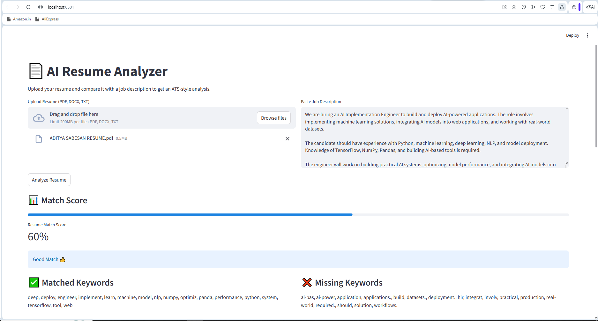
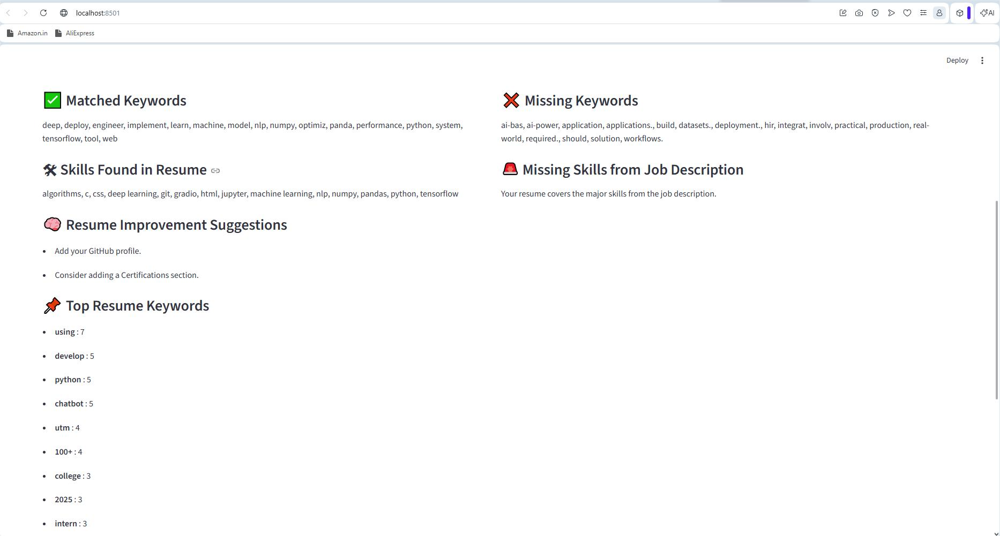
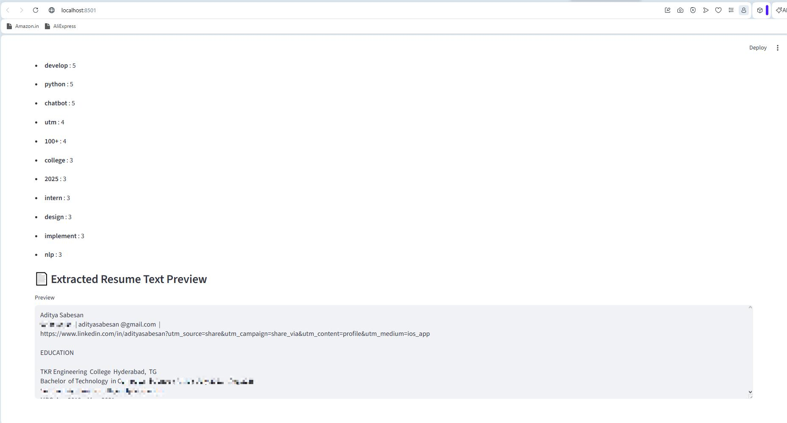

# AI Resume Analyzer

An AI-powered Resume Analyzer built using Python and Streamlit that compares a resume with a job description and provides ATS-style match scoring, keyword analysis, and improvement suggestions.

This tool helps job seekers quickly understand how well their resume aligns with a specific role and identify missing keywords or skills that may affect their chances in Applicant Tracking Systems (ATS).

---

## Features

- Upload resumes in **PDF, DOCX, or TXT format**
- Automatic **resume text extraction**
- Compare resume with a **job description**
- Calculate **ATS-style resume match score**
- Detect **matched and missing keywords**
- Identify **technical skills present in the resume**
- Provide **resume improvement suggestions**
- Display **top keywords used in the resume**
- Interactive **web interface using Streamlit**

---

## Tech Stack

- Python
- Streamlit
- PyPDF2 – PDF parsing
- python-docx – DOCX file processing
- NumPy & Pandas – data utilities
- Basic NLP techniques – tokenization and keyword analysis

---

## How It Works

1. Upload your **resume** (PDF, DOCX, or TXT).
2. Paste the **job description** for the role you are targeting.
3. Click **Analyze Resume**.
4. The system will:
   - Extract resume content
   - Compare it with job description keywords
   - Calculate a match score
   - Highlight missing skills and keywords
   - Suggest improvements

---

## Screenshots

### Application Interface


### Resume and Job Description Input


### Resume Analysis Results


---

## Installation

Clone the repository:

```
git clone https://github.com/adityasabesan/ai-resume-analyzer.git
cd ai-resume-analyzer
```

Install dependencies:

```
pip install -r requirements.txt
```

Run the application:

```
streamlit run app.py
```

Open in your browser:

```
http://localhost:8501
```

---

## Example Use Case

A candidate applying for an **AI/ML Engineer role** can paste the job description into the tool and instantly see:

- How well their resume matches the role
- Which keywords or skills are missing
- What improvements could increase ATS compatibility

---

## Future Improvements

- Semantic similarity scoring using advanced NLP
- Integration with LLM-based resume feedback
- Resume section detection and scoring
- Skill gap analysis and role-specific recommendations
- Online deployment for public access

---

## License

This project is licensed under the MIT License.

---

## Author

Aditya Sabesan  
GitHub: https://github.com/adityasabesan
